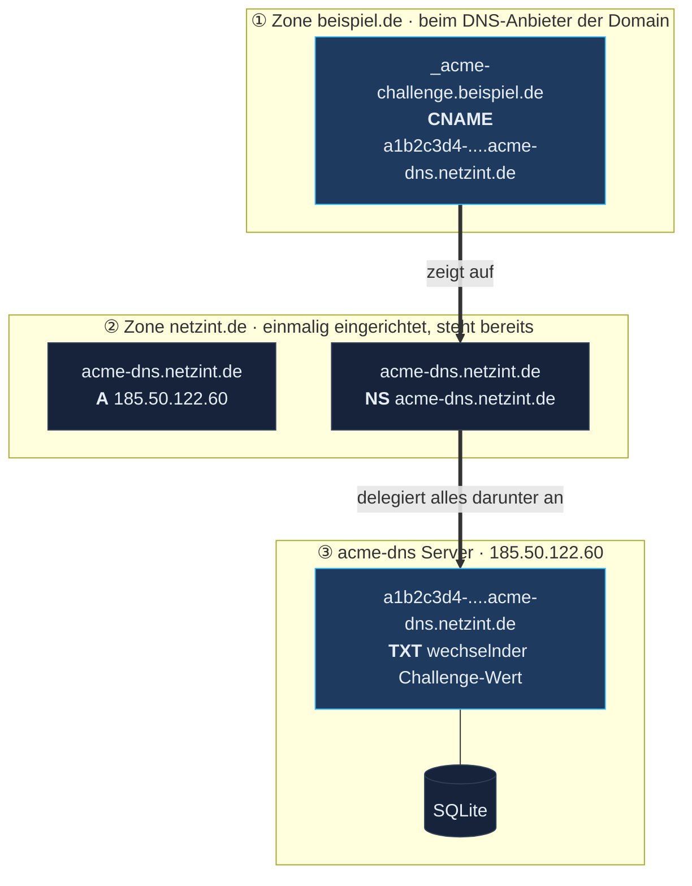
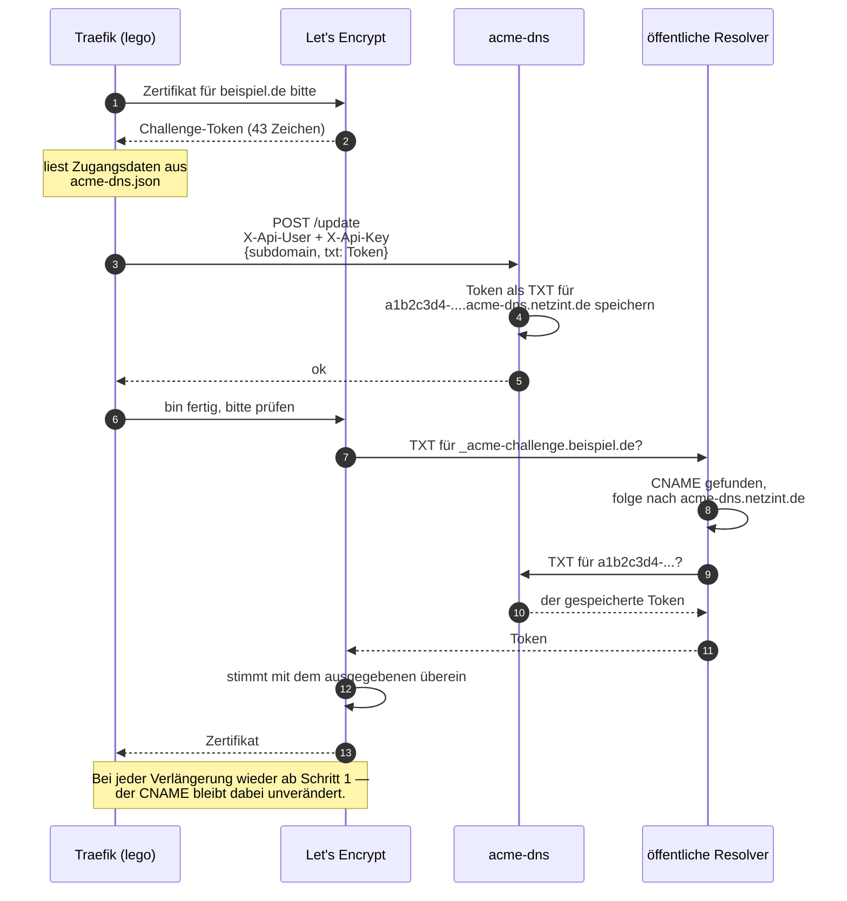
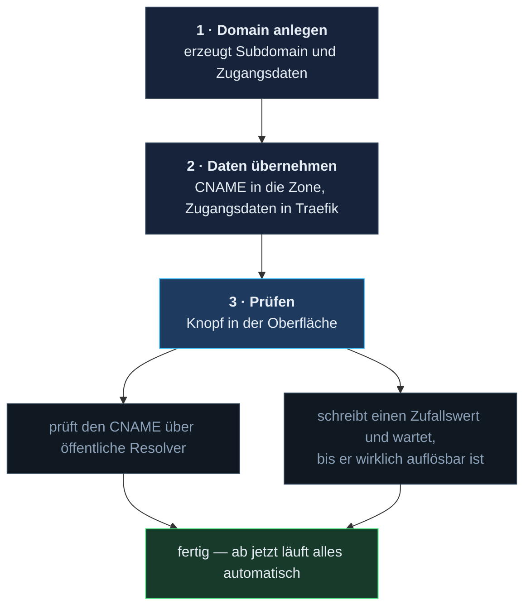
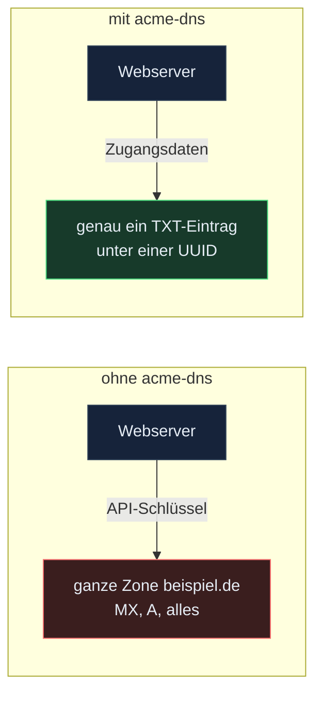

# Wie acme-dns funktioniert

Beispiel in diesem Dokument: die Domain **`beispiel.de`** soll ein Let's-Encrypt-Zertifikat
bekommen, ausgestellt über Traefik.

## Das Prinzip in einem Satz

Let's Encrypt verlangt für ein Zertifikat einen TXT-Eintrag unter
`_acme-challenge.beispiel.de` — statt dafür einen API-Zugang zur echten Zone von
`beispiel.de` zu brauchen, zeigt dort **einmalig** ein CNAME auf unseren acme-dns-Server,
der den wechselnden TXT-Wert dann selbst ausliefert.

## Wo welcher Eintrag steht

① muss **einmal von Hand** angelegt werden — danach nie wieder.
② steht bereits und gilt für alle Domains gemeinsam.
③ setzt acme-dns selbst, per API vom ACME-Client. Nie von Hand.

### Die Einträge im Klartext

| Wo | Eintrag | Wann |
| --- | --- | --- |
| Zone `netzint.de` | `acme-dns.netzint.de.  A   185.50.122.60` | einmalig, steht bereits |
| Zone `netzint.de` | `acme-dns.netzint.de.  NS  acme-dns.netzint.de.` | einmalig, steht bereits |
| Zone `beispiel.de` | `_acme-challenge.beispiel.de.  CNAME  a1b2c3d4-....acme-dns.netzint.de.` | **einmal pro Domain, von Hand** |
| — | der TXT-Wert | nie von Hand — den setzt der ACME-Client automatisch |

Der `NS`-Eintrag ist der eigentliche Trick: er sagt dem Internet „für alles unterhalb von
`acme-dns.netzint.de` ist dieser Server zuständig". Deshalb kann acme-dns dort beliebige
TXT-Werte ausliefern, ohne dass jemand eine Zonendatei bearbeitet.

## Wie eine Ausstellung abläuft

## Was die Oberfläche dabei macht

Schritt 3 prüft damit nicht nur, ob der CNAME formal richtig aussieht, sondern ob der
komplette Weg bis zum TXT-Wert wirklich funktioniert. Eine kaputte Delegierung oder ein
Tippfehler im Ziel fällt dadurch sofort auf, statt erst beim nächsten Ausstellversuch.

## Warum der Umweg überhaupt

Die naheliegende Alternative wäre, dem ACME-Client einen API-Schlüssel für die Zone von
`beispiel.de` zu geben. Der könnte dann aber **jeden** Eintrag der Domain ändern — MX,
A-Records, alles. Ein kompromittierter Webserver hätte damit die Kontrolle über die
gesamte Domain.

Mit acme-dns bekommt jeder Dienst stattdessen Zugangsdaten, die ausschließlich einen TXT-Wert
unter **einer einzigen** UUID-Subdomain setzen können. Mehr Schaden ist damit nicht möglich.

## Wenn etwas nicht geht

| Symptom | Ursache |
| --- | --- |
| Prüfung meldet „kein CNAME-Eintrag" | Der CNAME in der Zone von `beispiel.de` fehlt oder ist noch nicht propagiert |
| Prüfung meldet „zeigt auf das falsche Ziel" | CNAME zeigt auf eine andere Registrierung — Ziel aus dem Detail-Dialog vergleichen |
| CNAME stimmt, TXT-Test schlägt fehl | Delegierung erreicht den Server nicht, oder ein Resolver hält noch einen alten Eintrag |
| Client meldet 401 beim `/update` | Passwort passt nicht mehr — im Detail-Dialog „Neue Zugangsdaten" erzeugen und in Traefik nachtragen |

Wichtig bei allen Fehlern: **der CNAME bleibt gültig**. Selbst wenn Zugangsdaten neu
erzeugt werden, ändert sich die Subdomain nicht — in der Zone von `beispiel.de` muss also
nie etwas nachgezogen werden.
